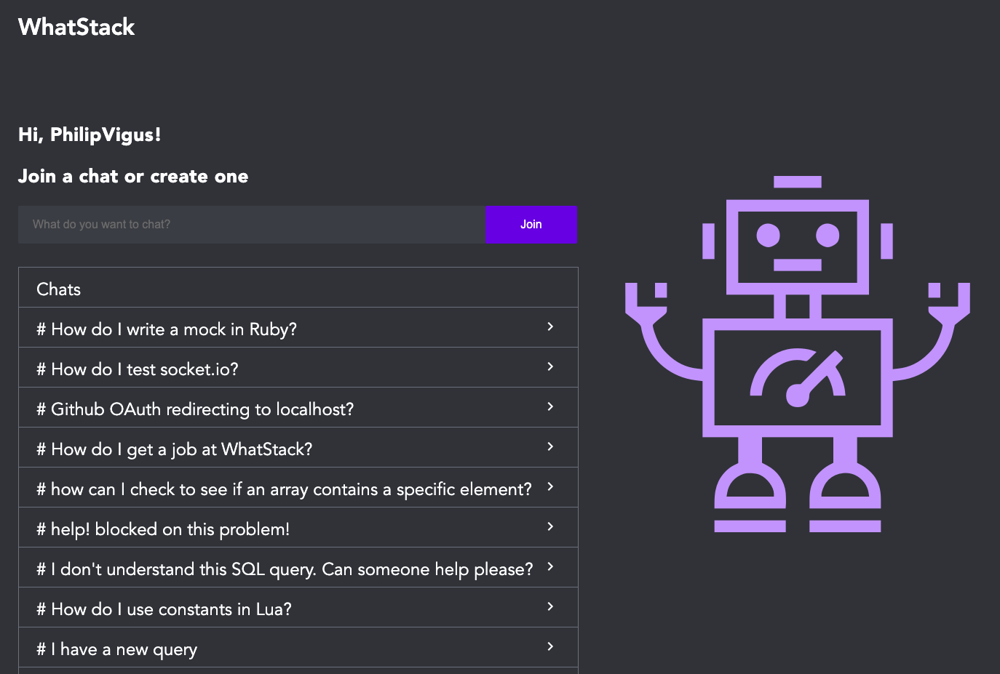
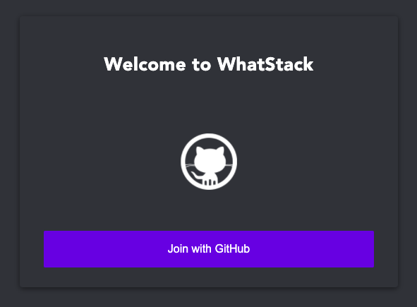
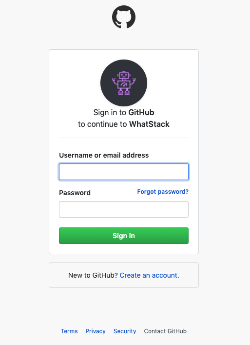
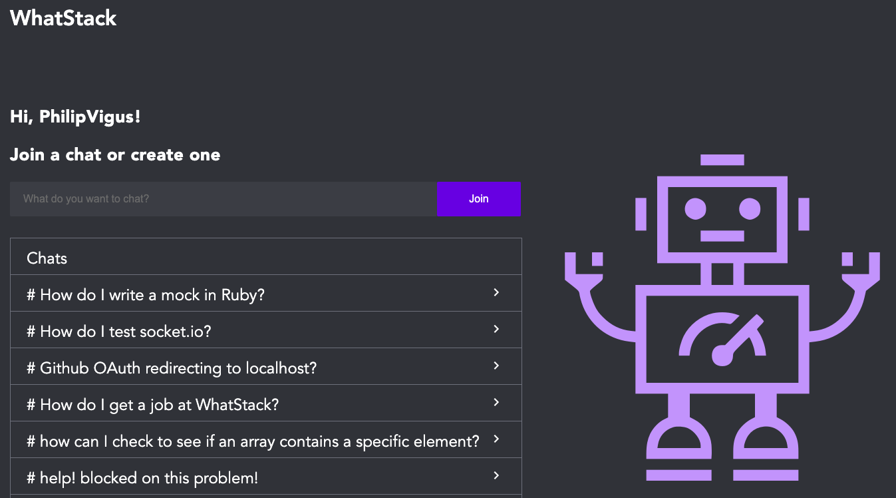
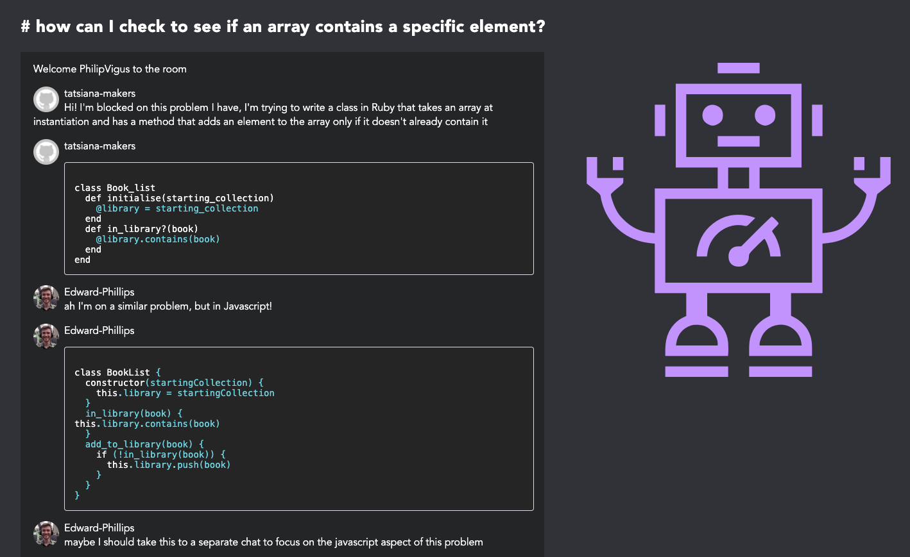

# WhatStack



## contributors

[Angelica Beristain](https://github.com/Angelica137) | [Faye Carter](https://github.com/FayeCarter) | [Steven Klavins](https://github.com/Steven-klavins) | [Edward Phillips](https://github.com/Edward-Phillips) | [Phil Vigus](https://github.com/PhilipVigus)

## sections

[Outline](#Outline) | [Specifications](#Specifications) | [User Stories](#User-Stories) | [Using Product](#Using-WhatStack) | [Set Up](#Set-up) | [Tech Stack](#Tech-Stack) | [Challenges](#Challenges) | [Feature Roadmap](#Feature-Roadmap)

# Outline

In this project we were given two weeks as a team of 5 to build a product to solve a problem, with a feature freeze on the second Wednesday and a demonstration on the final day.

# Specifications

During our time at makers we have been blocked. A lot. Asking for help can be tough, it's difficult to acknowledge your own ignorance and sometimes places can be less than welcoming to newcomers asking a question that's been covered before. Think back to all the times you've seen someone on Stack Overflow saying "that's a stupid question" or "This is a duplicate of \<some other question which while similar isn't actually your question>"

We decided that

- it shouldn't be so hard to ask for help
- you can reach a solution quicker through a 5 minute conversation than posting a question on a message board and hoping someone gets back to you with something more positive than "that's a stupid question"
- if someone has the same problem as you, they should be able to be part of that conversation.

# User Stories

To view the user stories that this project has completed features for [please visit our wiki page!](https://github.com/FayeCarter/WhatStack/wiki/User-Stories)

# Using WhatStack

Want to check the application out? [Click here!](https://whatstack.herokuapp.com)

## Logging in

Whatstack is designed to be easy to access for developers, so instead of having to create an account and register, you can simply login with your Github account.

When you start go to the main web address you see the following screen.



Clicking 'Join with GitHub' takes you to Github, where you are asked to verify you are happy to log in using your Github account.



## opening a chat room

Once you're logged in you'll be taken to the /rooms screen, which is where you can either make a new room to help you with your problem, or if you see another room already there that covers it you can join that conversation instead.



## sending (_plaintext_) messages

Once you're in a room you can contribute to the conversation by typing your message into the text area and clicking the 'send message' button.

## sending (_codeblock_) messages

Want to send a block of code? No problem, simply add three backtics (\`\`\`) to the beginning and end of your code block, you can even specify a language for the code to be formatted in by writing the language immediately after the backticks e.g. \`\`\`ruby \<some code> \`\`\` and the result will be a code block correctly highlighted in the ruby style. The language is set to javascript by default.



# Set up

The steps below outline how to set up the project to run on your local machine.

## Set up a MongoDB database

- Follow the appropriate instructions [here](https://docs.mongodb.com/manual/installation/) if you want your database to be hosted on your local machine (recommended if you just want to play around with the code).
- An alternative is to set up a remote database on a service such as Atlas, in which case follow the instructions [here](https://docs.atlas.mongodb.com/getting-started/)

## Set up your Github Auth0 application

- Follow the instructions [here](https://auth0.com/docs/connections/social/github)

## Get the repository and add sensitive information needed for the application to work

- Clone the repo
- run npm install in the root and client folders to install project dependencies
- Create a .env file in the root folder with the following content (some of this information is sensitive and should not be uploaded to GitHub)

```
GITHUB_CLIENT_ID=<from your github Auth0 account>
GITHUB_CLIENT_SECRET=<from your github Auth0 account>
COOKIE_SECRET = <choose an appropriate password>
BACKEND = http://localhost:5000
FRONTEND = http://localhost:3000
MONGOCREDS = <link to your mongodb database>
SKIP_PREFLIGHT_CHECK=true
```

- Create a .env file in the client folder with the following content

```
SKIP_PREFLIGHT_CHECK=true
REACT_APP_BACKEND = http://localhost:5000
```

## Start the application

```
# Start the server from the root directory
npm start

# Start the React server from the client directory
npm start
```

This should automatically open the application webpage if you've set up everything correctly.

# Tech Stack

## Frontend

The frontend for this project uses React to generate a Single Page Application served on the "/" route.

## Backend

The backend for this project uses NodeJS and Express to serve the "/" route and various backend routes.

## Database

The project uses MongoDB for its database and this is hosted remotely on Atlas. Mongoose is used to translate data between the database and Express in the backend.

## Testing

Due to the exploratory and experimental nature of this project, testing was limited to exemplars of how difficult-to-test behaviours should be written. Backend tests use Jest, while those for the frontend also employ the React Testing Library.

## Hosting

The project is hosted on Heroku, as they provide a free tier and have excellent documentation and support for common issues when deploying.

# Challenges

As a team we encountered several challenges while working on this project:

- Testing

  - Testing was a challenge from the start. As we chose to work technologies that were new to us, it was extremely challenging to write tests to drive the development of our code, as we did not know how to express the desired behaviour

  - As a group, after spending some time trying to drive the development of the project through tests, we decided that TDD/test coverage was secondary to learning these new technologies. We agreed that we would manually test our code until our knowledge had reached a point where we were able to write tests for the desired behaviour

    An example of this was testing sockets, which was a real challenge as there was a lack of information online. However, after much trial and error we found a way to do this and wrote exemplars on how to test sockets on both the server and client side

- Time

  - Managing time over the course of the project was a challenge as it coincided with the late May bank holiday. This meant we lost a day of project time, which really put pressure on us to achieve our minimum viable product(MVP) by the deadline we had set

    Once we relaxed these deadlines work went a lot more smoothly. We were also able to make up some of the lost time by working to work over part of the middle weekend

- Knowledge Sharing

  - Knowledge sharing was a concern from the get-go. We knew it was inevitable that some people would end up with higher knowledge levels in certain sections of the codebase than others. To combat this we frequently rotated pairs and had code demos in our daily retros so that even if you didn't work on the code you were walked through what it did and how it did it and had an opportunity to ask questions about it

    We also made sure every pull request was reviewed by two team members who hadn't worked on the ticket prior to merging to ensure the code was easy to read and that team members were exposed to the whole codebase as much as possible

- Learning new Languages and technologies
  - Learning a new technologies can be a challenge, but in this project it was a really enjoyable experience. Our approach was to find the simplest thing we wanted to achieve, research how to do that, implement the code and repeat that process until the feature was completed
  - For particularly challenging aspects such as the initial set up of sockets, we followed tutorials on test projects that achieved something similar, and then used the knowledge we'd gained to build the feature in our project
  - People who had researched a particular aspect of a technology would pair with those less familiar to prevent any knowledge towers developing.

# Feature Road Map

This isn't the end of the story for WhatStack. To have a sneak peek at what we'll be working on for WhatStack in the future, [please visit our wiki page!](https://github.com/FayeCarter/WhatStack/wiki/Roadmap---User-Stories)

# Team Rituals

## Daily Schedule

| Time            | Activity         |
| --------------- | ---------------- |
| 10am - 10:30am  | Check in/Standup |
| 10:30am - 12:30 | Pairing          |
| 12:30 - 2:00pm  | Lunch/Meditation |
| 2:00pm - 2:15pm | Check in         |
| 2:15pm - 5:30pm | Pairing          |
| 5:30pm - 6:00pm | Retro            |

## Team Charter

On the first day as a team we asked ourselves 9 questions and used these to make a team charter describing the expectations we had of each other in terms of how we would behave and what we would bring to the project. [To view the team charter please click here](https://docs.google.com/document/d/1cNusSTAwBtW7N1OJQLXIJcQ3w3KQ1dgRsCGy9vDCLwA/edit)

## Agile workflow

An essential part of this project was how we worked. We all agreed to follow an agile workflow with 2 day sprints to track velocity.

At the start of each sprint we agreed the features we were focusing on implementing, and used planning poker to estimate resource required to complete them.

At the beginning of each day we held stand up meetings to discuss previous and potential blockers, progress, and plans for the day.

At the end of each sprint we had a slightly longer retro where we discussed how we felt the team had fared during the sprint and what we could do to address any problems that were identified.
